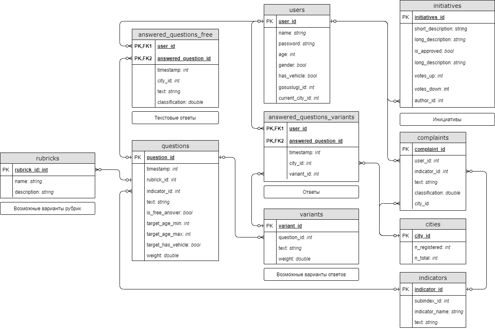

# "Умный город": Система Анализа Мнений

Инструмент учета мнения и пожеланий жителей при оценке каждого из субиндексов. Приложение позволяет собирать мнения на тему различных инициатив, формировать серии опросов и проводить градацию ответов по шкале негативности-позитивности посредством применения машинного обучения. Также реализуется функция "единого окна" жалоб и предложений.

**Средства разработки:** Python, FastAPI, SQLite, scikit learn, Flutter.

## Инструкция по запуску

## Принципы работы

Реализованы 2 подхода к сбору мнений:
1. Активный пользователь отвечает на несколько коротких вопросов в неделю.
2. Пользователь может отправить жалобу или выступить с инициативой через систему.

Каждый вопрос имеет собственный вес и в соответствии с ним влияет на соответствующий мнению по выбранному субиндексу показатель. Для анализа текстовых данных используется определение его тональности (эмоционального окраса) с помощью наивного байесовского классификатора. Значение показателя для одного субиндекса может быть вычислено по формулам:

   

   

   

Здесь:
-  - множество вопросов;
-  - множество жалоб;
-  - множество вариантов ответов на вопрос ;
-  - множество ответов на вопрос  в свободной форме;
-  - вес вопроса ;
-  - положительность варианта  (задается вручную);
-  - доля выбравших вариант  пользователей среди всех проголосовавших;
-  - оценка тональности текста;
-  - гиперпараметр алгоритма - предполагаемое влияние жалоб на показатель.

## FAQ

**Как сбор мнений поможет расчету индекса?**

**Почему статистика не будет субъективной?**

**Почему способ быстрее и проще текущих способов ручного сбора данных?**
